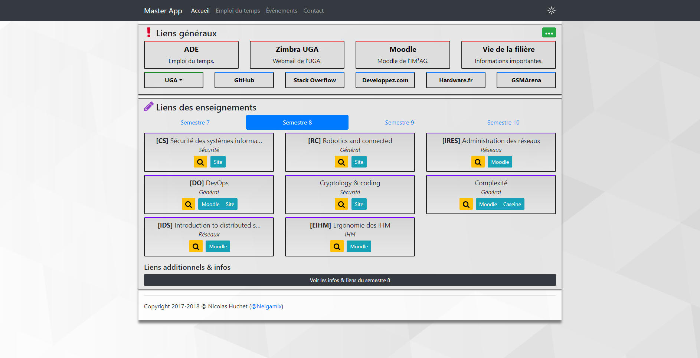
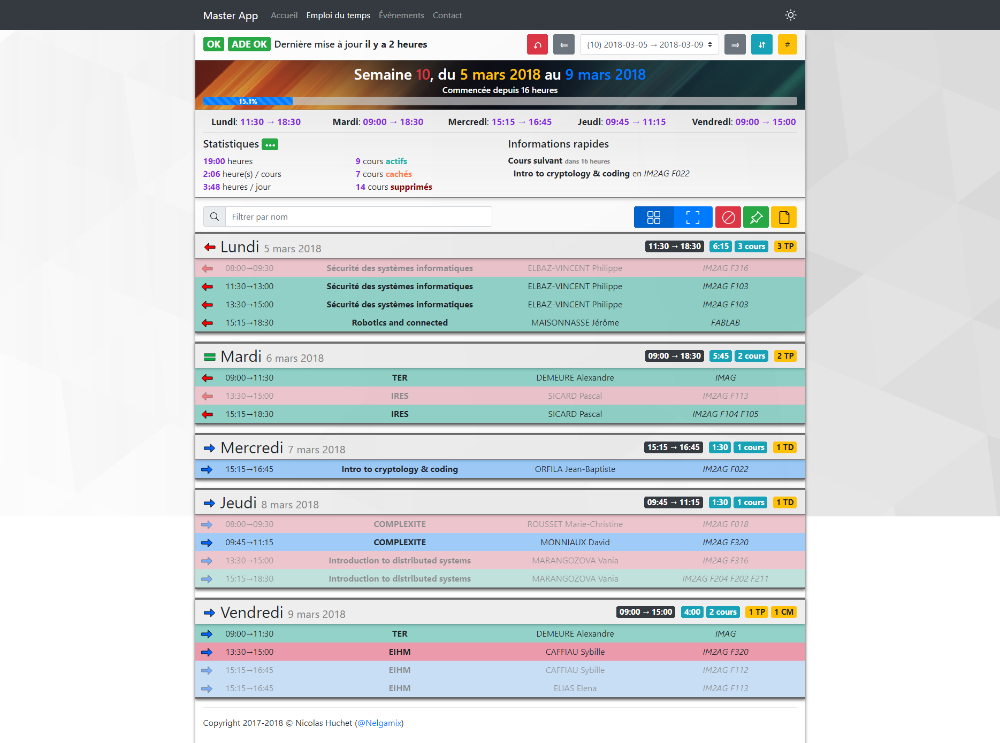
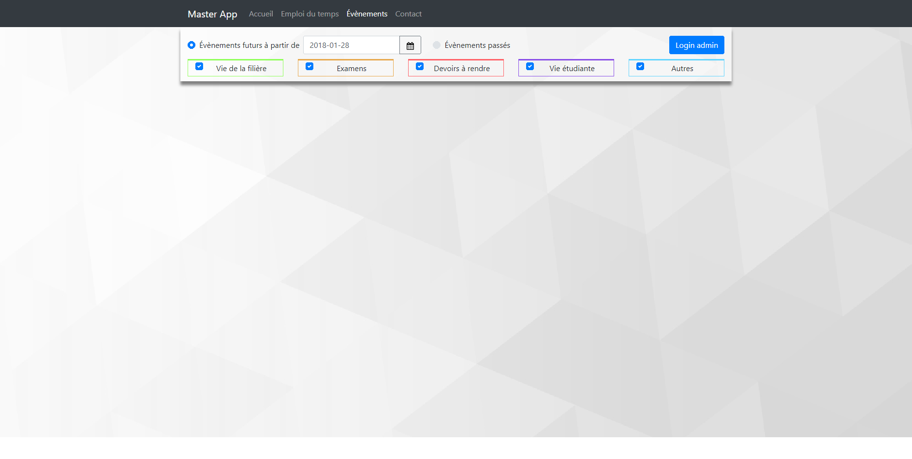
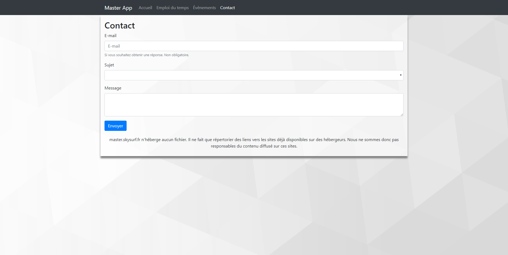

# MasterEtWeb

This project was generated with [Angular CLI](https://github.com/angular/angular-cli) version 1.2.3.

## Angular CLI

### Code scaffolding

Run `ng generate component component-name` to generate a new component. You can also use `ng generate directive|pipe|service|class|module`.

### Help

To get more help on the Angular CLI use `ng help` or go check out the [Angular CLI README](https://github.com/angular/angular-cli/blob/master/README.md).

## Project notes

### Images
Mise à jour des images: 1.4.1

#### Accueil

#### Emploi du temps

#### Evenements

#### Contact

### Organisation

Front-end: Angular 4+, dossier src/app

Back-end: PHP 7+, dossier src/php

Le build se fait avec:
* `ng build`
* `ng build --prod`
* npm (voir [package.json](package.json))

Pour dév en local, trois choses à changer:
* [.htaccess](src/.htaccess): changer 3] `RewriteBase /` en `RewriteBase /xxx/yyy/`
avec xxx/yyy/ étant le chemin depuis la racine web
* [index.html](src/index.html): changer 6] `<base href="/">` en `<base href="/xxx/yyy/">`,
pareil qu'au dessus OU lancer le build prod (npm)
* [commons.php](src/php/commons.php): changer 5] `define("LOCAL", false);` en `define("LOCAL", true);`
pour activer le mode local. Ne pas oublier de changer les valeurs des constantes pour la connexion à
la BD!

Quelques logiciels à installer:
* [XAMPP](https://www.apachefriends.org/fr/index.html): serveur web + BD
* [IntelliJ IDE](https://www.jetbrains.com/products.html): Des IDE pour dév

Les images/icons: [Font Awesome](https://www.flaticon.com/packs/font-awesome)

NG Bootstrap: https://ng-bootstrap.github.io/#/components/accordion/examples

Bootstrap: https://getbootstrap.com/docs/4.0/components/alerts/

Icons: https://www.flaticon.com/packs/multimedia-element-set

### TODO

* Page "News"?
* Fixer style de la page d'accueil, de l'et
* Fixer les couleurs de ev
